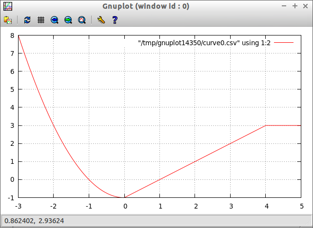
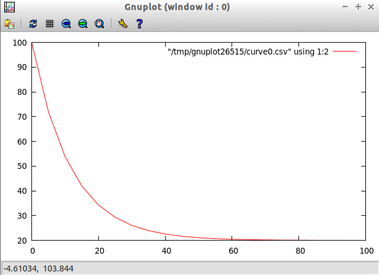

<!-- START doctoc generated TOC please keep comment here to allow auto update -->
<!-- DON'T EDIT THIS SECTION, INSTEAD RE-RUN doctoc TO UPDATE -->
**Table of Contents**  *generated with [DocToc](https://github.com/thlorenz/doctoc)*

- [Applications](#applications)
  - [Mathematics](#mathematics)
  - [Picewise Functions](#picewise-functions)
  - [Numerical Methods](#numerical-methods)
    - [Polynomial](#polynomial)
    - [Numerical Derivate](#numerical-derivate)
    - [Nonlinear Equation - Root-finding](#nonlinear-equation---root-finding)
- [     t -> Int -> (t -> t) -> (t -> t) -> t -> (t, t, Int)](#t---int---t---t---t---t---t---t-t-int)
    - [Differential Equations](#differential-equations)
  - [Statistics and Time Series](#statistics-and-time-series)
    - [Some Statistical Functions](#some-statistical-functions)
    - [Monte Carlo Simulation Coin Toss](#monte-carlo-simulation-coin-toss)
- [](#)
- [](#-1)
- [](#-2)
- [](#-3)
  - [Vectors](#vectors)
  - [Tax Brackets](#tax-brackets)
  - [Small DSL Domain Specific Language](#small-dsl-domain-specific-language)
    - [String Processing](#string-processing)

<!-- END doctoc generated TOC please keep comment here to allow auto update -->

## Applications


### Mathematics


**Trigonometric Degree Functions**

```haskell

deg2rad deg = deg*pi/180.0  -- convert degrees to radians
rad2deg rad = rad*180.0/pi  -- convert radians to degrees

sind = sin . deg2rad        
cosd = cos . deg2rad        
tand = tan . deg2rad
atand = rad2deg . atan
atan2d y x = rad2deg (atan2 y x )
```

Example:


```haskell

> map rad2deg [pi/6, pi/4, pi/3, pi/2, pi]
[29.999999999999996,45.0,59.99999999999999,90.0,180.0]
> 
> 

> map sind [30.0, 45.0, 60.0, 90.0, 180.0 ]
[0.49999999999999994,0.7071067811865475,0.8660254037844386,1.0,1.2246063538223773e-16]
> 
```


### Picewise Functions


Implement the following functions in Haskell

```

       /  0.10    if 0.0      <= x <= 7150.0
       |  0.15    if 7150.0   <  x <= 29050.0
       |  0.25    if 29050.0  <  x <= 70350.0
f1(x)= |  0.28    if 70350.0  <  x <= 146750.0
       |  0.33    if 146750.0 <  x <= 319100.0
       \  0.35    if 139100.0 <  x < +infinitum


       /  x^2 - 1  if x < 0
f2(x) = |  x   - 1  if 0 <= x < 4
       \  3        if x > 4
```

```haskell

import Graphics.Gnuplot.Simple

(|>) x f = f x
(|>>) x f = map f x

pairs xs = zip xs (tail xs)

infp =    1.0e30  -- Plus Infinite
infm = (-1.0e30)  -- Minus Infinite

inInterval x (p1, p2) = (fst p1) < x && x <= (fst p2) 

piceWiseFactory intervalTable x = f x
    where
    f =  filter (inInterval x) (pairs intervalTable) 
        |> head 
        |> fst 
        |> snd 

arange start stop step = [start,(start+step)..(stop-step)]

plotFxs f xs  = do
    let ys = map f xs
    plotList [] (zip xs ys)


f1_table = 
    [
    (0.0,        const 0.10),
    (7150.0,     const 0.15),
    (29050.0,    const 0.25),
    (70350.0,    const 0.28),
    (146750.0,   const 0.33),  
    (319100.0,   const 0.35),  
    (1.0e30,     const 0.35)
    ]

f2_table = [
    (infm,  \x -> x**2 - 1), --  if -∞ < x <= 0  -> x^2 - 1 
    (0.0,   \x -> x - 1.0 ), --  if 0  < x <= 4  -> x   - 1
    (4.0,   \x -> 3.0),      --  if 4  < x <= +∞ -> 3.0
    (infp,  \x -> 3.0 )
    ]

f1 = piceWiseFactory f1_table
f2 = piceWiseFactory f2_table

```

```haskell
> plotFxs f1 $ arange (1.0) 400000 1000.0
```


```haskell
> plotFxs f2 $ arange (-4) 4 0.01
```




### Numerical Methods 

#### Polynomial

Polynomial evaluation by the horner method.

```haskell
polyval :: Fractional a => [a] -> a -> a
polyval coeffs x = foldr (\b c -> b + x*c) 0 coeffs

polyderv :: Fractional a => [a] -> [a] 
polyderv coeffs = zipWith (*) (map fromIntegral [1..n]) (tail coeffs )
    where
    n = (length coeffs) - 1    

```

Example:

```
Reference: http://www.math10.com/en/algebra/horner.html

f(x) = a0 + a1x + a2x2 + a3x3 + a4x4 + a5x5
f(x0) = a0 + x0(a1 + x0(a2 + x0(a3 + x0(a4 + a5x0)))) 

Example: Evaluate the polynomial 
    f(x)  =  1x4 + 3x3 + 5x2 + 7x + 9 at x = 2 
    df(x) =  3x3 + 6x2 + 10x +  7
```

```haskell
    
> let coeffs  = [9.0, 7.0, 5.0, 3.0, 1.0] 
> let f  = polyval  coeffs

let df = polyval $  polyderv coeffs

> polyderv coeffs 
[7.0,10.0,9.0,4.0]

> f 2
83.0

> df 2
95.0

> (\x -> 7 + 10*x + 9*x^2 + 4*x^3) 2
95
```


#### Numerical Derivate

```haskell

derv dx f x = (f(x+dx) - f(x))/dx

f x = 2*x**2 - 2*x
df = derv 1e-5 f

*Main> map f [2, 3, 4, 5] 
[4.0,12.0,24.0,40.0]
*Main> 

*Main> let df = derv 1e-5 f
*Main> 
*Main> map df  [2, 3, 4, 5]
[6.000020000040961,10.000019999978349,14.000019999116374,18.000019998964945]
*Main> 

*Main> let dfx x = 4*x - 2
*Main> map dfx [2, 3, 4, 5]
[6,10,14,18]
```

#### Nonlinear Equation - Root-finding

See also: 

* [Root finding](http://en.wikipedia.org/wiki/Root-finding_algorithm)
* [Newton's method](http://en.wikipedia.org/wiki/Newton's_method)
* [Bisection method](http://en.wikipedia.org/wiki/Bisection_method)

**Bisection Method**

```haskell

bisection_iterator :: (Floating a, Floating a1, Ord a1) => (a -> a1) -> [a] -> [a]
bisection_iterator f guesslist = newguess
    where
    a =  guesslist !! 0
    b =  guesslist !! 1
    c = (a+b)/2.0
    p = f(a)*f(c)
    newguess = (\p -> if p < 0.0 then [a, c] else [c, b] ) p


bisectionSolver eps itmax f x1 x2 = (root, error, iterations) 
    where  
    
    bisection_error xlist = abs(f $ xlist !! 1)
    check_error xlist = bisection_error xlist > eps

    iterator = bisection_iterator  f

    rootlist = [x1, x2] |> iterate iterator |> takeWhile check_error |> take itmax

    pair = last rootlist |> iterator
    root = last pair
    error = bisection_error pair

    iterations = length rootlist    

*Main> let f x  =  exp(-x) -3*log(x)
*Main> bisectionSolver 1e-5 100 f 0.05 3
(1.1154509544372555,8.86237816760671e-6,19)
*Main> 

```

**Newton Raphson Method**

```haskell
{-
Newton-Raphson Method Iterator, builds an iterator function
from the function to be solved and its derivate.

-}
newton_iterator f df x = x - f(x)/df(x)

{---------------------------------------------------------------------
    newtonSolver(eps, itmax, f, df, guess)

    Solve equation using the Newton-Raphson Method.
    
    params:
    
        eps   :  Tolerance of the solver
        itmax :  Maximum number of iterations
        f     :  Function which the root will be computed
        df    :  Derivate of the function
        guess :  Initial guess 

newtonSolver
  :: (Fractional t, Ord t) =>
     t -> Int -> (t -> t) -> (t -> t) -> t -> (t, t, Int)
-----------------------------------------------------------------------
-}
newtonSolver :: (Floating t, Ord t) => t -> Int -> (t -> t) -> (t -> t) -> t -> (t, t, Int)
newtonSolver eps itmax f df guess = (root, error, iterations)
    where
    check_root x = abs(f(x)) > eps                                  
    iterator = newton_iterator f df   -- Builds the Newton Iterator                              
    generator = iterate $ iterator    -- Infinite List that will that holds the roots (Lazy Evaluation)

    rootlist = take itmax $ takeWhile check_root $ generator guess                                  
    root = iterator $ last $ rootlist                                  
    error = abs(f(root))
    iterations = length rootlist


square_root a | a > 0       = newtonSolver 1e-6 50 (\x -> x^2 -a) (\x -> 2*x) a 
              | otherwise   = error ("The argument must be positive")

{- 
    Solve f(x) = x^2 - 2 = 0 
    
    The solution is sqrt(2)
-}
> let f x = x^2 - 2.0
> 
> let df x = 2*x
> 
> let df x = 2.0*x
> 
> newtonSolver 1e-3 100 f df 5
(1.414470981367771,7.281571315052027e-4,4)
> 
> newtonSolver 1e-3 100 f df 50
(1.4142150098491113,4.094082521888254e-6,8)
> 
```

**Secant Method**

```haskell

(|>) x f = f x
(|>>) x f = map f x

secant_iterator :: Floating t => (t -> t) -> [t] -> [t]
secant_iterator f guesslist = [x, xnext]
    where
    x =  guesslist !! 0
    x_ = guesslist !! 1
    xnext = x - f(x)*(x-x_)/(f(x) - f(x_))

secantSolver eps itmax f x1 x2 = (root, error, iterations) 
    where  
    
    secant_error xlist = abs(f $ xlist !! 1)
    check_error xlist = secant_error xlist > eps

    iterator = secant_iterator  f

    rootlist = [x1, x2] |> iterate iterator |> takeWhile check_error |> take itmax

    pair = last rootlist |> iterator
    root = last pair
    error = secant_error pair

    iterations = length rootlist

*Main> let f x = x^2 - 2.0
*Main> secantSolver  1e-4 20 f 2 3
(1.4142394822006472,7.331301515467459e-5,6)
*Main> 
*Main> let f x = exp(x) - 3.0*x^2
*Main> secantSolver 1e-5 100 f (-2.0)  3.0
(-0.458964305393305,6.899607281729558e-6,24)
*Main> 

```

#### Differential Equations

**Euler Method**

The task is to implement a routine of Euler's method and then to use it to solve the given example of Newton's cooling law with it for three different step sizes of 2 s, 5 s and 10 s and to compare with the analytical solution. The initial temperature T0 shall be 100 °C, the room temperature TR 20 °C, and the cooling constant k 0.07. The time interval to calculate shall be from 0 s to 100 s

From: http://rosettacode.org/wiki/Euler_method

```
Solve differential equation by the Euler's Method.

    T(t)
    ---- =  -k(T(t) - Tr)
     dt
    
    T(t) = Tr + k(T0(t) - Tr).exp(-k*t)
```

```haskell


import Graphics.Gnuplot.Simple


eulerStep f step (x, y)= (xnew, ynew)
                    where
                    xnew = x + step
                    ynew = y + step * (f (x, y))

euler :: ((Double, Double) -> Double) -> Double -> Double -> Double -> Double -> [(Double, Double)]
euler f x0 xf y0 step = xypairs
                     where
                     iterator = iterate $ eulerStep f step
                     xypairs = takeWhile (\(x, y) -> x <= xf ) $ iterator (x0, y0)

> let dTemp k temp_r (t, temp) = -k*(temp - temp_r)

> euler (dTemp 0.07 20.0) 0.0 100.0 100.0 5.0
[(0.0,100.0),(5.0,72.0),(10.0,53.8),(15.0,41.97) \.\.\.
(100.0,20.01449963666907)]
> 

let t_temp = euler (dTemp 0.07 20.0) 0.0 100.0 100.0 5.0

plotList [] t_temp

```



**Runge Kutta RK4**

See also: [Runge Kutta Methods](http://en.wikipedia.org/wiki/Runge%E2%80%93Kutta_methods)

```haskell

import Graphics.Gnuplot.Simple

rk4Step f h (x, y) = (xnext, ynext)
                      where
                      
                      k1 = f (x, y)
                      k2 = f (x+h/2, y+h/2*k1)
                      k3 = f (x+h/2, y+h/2*k2)
                      k4 = f (x+h,y+h*k3)
                      
                      xnext = x + h
                      ynext = y + h/6*(k1+2*k2+2*k3+k4)
                      
rk4 :: ((Double, Double) -> Double) -> Double -> Double -> Double -> Double -> [(Double, Double)]
rk4 f x0 xf y0 h = xypairs
                     where
                     iterator = iterate $ rk4Step f h
                     xypairs = takeWhile (\(x, y) -> x <= xf ) $ iterator (x0, y0)

> let dTemp k temp_r (t, temp) = -k*(temp - temp_r)
> 
> let t_temp = rk4 (dTemp 0.07 20.0) 0.0 100.0 100.0 5.0
> plotList [] t_temp
> 
```

### Statistics and Time Series

#### Some Statistical Functions

Arithmetic Mean of a Sequence

```haskell
mean lst = sum lst / fromIntegral (length lst)
```

Geometric Mean of Sequence 
```haskell
geomean lst = (product lst) ** 1/(fromIntegral (length lst))
```

Convert from decimal to percent
```haskell
to_pct   lst = map (100.0 *) lst {- Decimal to percent -}
from_pct lst = map (/100.0)  lsd {- from Percent to Decimal -}
```

Lagged Difference of a time serie
* lagddif [xi] = [x_i+1 - x_i]
```haskell
lagdiff lst = zipWith (-) (tail lst) lst
```

Growth of a Time Serie
* growth [xi] = [(x_i+1 - x_i)/xi]
```haskell
growth lst = zipWith (/) (lagdiff lst) lst
```

Percentual Growth
```haskell
growthp = to_pct . growth
```

Standard Deviation and Variance of a Sequence

```haskell
{- Standard Deviation-}
stdev values =  values   |>> (\x -> x -  mean values ) |>> (^2) |> mean |> sqrt

{- Standard Variance -}
stvar values = stdev values |> (^2)
```

**Example: Investment Return**

The annual prices of an Blue Chip company are given below,
find the percent growth rate at the end of each year and 
the [CAGR](http://www.investopedia.com/articles/analyst/041502.asp) Compound annual growth rate.

```
year    0    1     2     3     4     5
price  16.06 23.83 33.13 50.26 46.97 39.89
```

Solution:

```haskell

> let (|>) x f = f x
> let (|>>) x f = map f x
>
> let cagr prices = (growthp prices |>> (+100) |> geomean ) - 100
>
> let prices = [16.06, 23.83, 33.13, 50.26, 46.97, 39.89 ]
> 
> {- Percent Returns -}
> let returns = growthp prices
> 
> returns
[48.38107098381071,39.02643726395302,51.705402958044054,-6.545961002785513,-15.073451139024908]
> 

> let annual_cagr = cagr prices 
> annual_cagr 
19.956476057259906
> 

```

#### Monte Carlo Simulation Coin Toss

The simplest such situation must be the tossing of a coin. Any individual event will result in the coin falling with one side or the other uppermost (heads or tails). However, common sense tells us that, if we tossed it a very large number of times, the total number of heads and tails should become increasingly similar. For a greater number of tosses the percentage of heads or tails will be next to 50% in a non-biased coin. Credits: [Monte Carlo Simulation - Tossing a Coin](http://staff.argyll.epsb.ca/jreed/math7/strand4/4203.htm)

See [Law of Large Numbers](http://en.wikipedia.org/wiki/Law_of_large_numbers)


File: coinSimulator.hs
```haskell
import System.Random
import Control.Monad (replicateM)

{-
    0 - tails
    1 - means head

-}

flipCoin :: IO Integer
flipCoin = randomRIO (0, 1)

flipCoinNtimes n = replicateM n flipCoin

frequency elem alist = length $ filter (==elem) alist

relativeFreq :: Integer -> [Integer] -> Double
relativeFreq elem alist = 
    fromIntegral (frequency elem alist) / fromIntegral (length alist)

simulateCoinToss ntimes =  do
    serie <- (flipCoinNtimes  ntimes)
    let counts = map (flip frequency serie)   [0, 1]
    let freqs = map (flip relativeFreq serie) [0, 1]
    return (freqs, counts)

showSimulation ntimes = do
    result <- simulateCoinToss ntimes
    let p_tails = (fst result) !! 0
    let p_heads = (fst result) !! 1
    
    let n_tails = (snd result) !! 0
    let n_heads = (snd result) !! 1
    
    let tosses = n_tails + n_heads
    let p_error = abs(p_tails - p_heads)
    
    putStrLn $ "Number of tosses : " ++ show(tosses)
    putStrLn $ "The number of tails is : " ++ show(n_tails)        
    putStrLn $ "The number of heads is : " ++ show(n_heads)
    putStrLn $ "The % of tails is : " ++ show(100.0*p_tails)
    putStrLn $ "The % of heads is :" ++ show(100.0*p_heads)
    putStrLn $ "The %erro is : "  ++ show(100*p_error)
    putStrLn "\n-------------------------------------"
```


```
> :r
[1 of 1] Compiling Main             ( coinSimulator.hs, interpreted )
Ok, modules loaded: Main.
> 

> :t simulateCoinToss 
simulateCoinToss :: Int -> IO ([Double], [Int])
> 

> :t showSimulation 
showSimulation :: Int -> IO ()
> 


> simulateCoinToss 30
([0.5666666666666667,0.43333333333333335],[17,13])
> 
> simulateCoinToss 50
([0.56,0.44],[28,22])
> 
> simulateCoinToss 100
([0.46,0.54],[46,54])
> 
> simulateCoinToss 1000
([0.491,0.509],[491,509])
> 

> mapM_ showSimulation [1000, 10000, 100000, 1000000]
Number of tosses : 1000
The number of tails is : 492
The number of heads is : 508
The % of tails is : 49.2
The % of heads is :50.8
The %erro is : 1.6000000000000014

-------------------------------------
Number of tosses : 10000
The number of tails is : 4999
The number of heads is : 5001
The % of tails is : 49.99
The % of heads is :50.01
The %erro is : 1.9999999999997797e-2

-------------------------------------
Number of tosses : 100000
The number of tails is : 49810
The number of heads is : 50190
The % of tails is : 49.81
The % of heads is :50.19
The %erro is : 0.38000000000000256

-------------------------------------
Number of tosses : 1000000
The number of tails is : 499878
The number of heads is : 500122
The % of tails is : 49.9878
The % of heads is :50.01219999999999
The %erro is : 2.4399999999996647e-2

-------------------------------------
```

### Vectors

**Dot Product of Two Vectors / Escalar Product**

* v1.v2 = (x1, y1, z1) . (x2, y2, z2) = x1.y1 + y1.y2 + z2.z1
* v1.v2 = Σai.bi

```haskell

> let dotp v1 v2 = sum ( zipWith (*) v1 v2 )   - With Parenthesis
> let dotp v1 v2 = sum $ zipWith (*) v1 v2     - Without Parenthesis with $ operator

> dotp [1.23, 33.44, 22.23, 40] [23, 10, 44, 12]
1820.81


```

**Norm of a Vector**

* norm = sqrt( Σxi^2)

```haskell
> let norm vector = (sqrt . sum) (map (\x -> x^2) vector)

> norm [1, 2, 3, 4, 5]
7.416198487095663

-- Vector norm in multiple line statements in GHCI interactive shell

> :{
| let {
|      norm2 vec =  sqrt(sum_squares)
|      where 
|      sum_squares = sum(map square vec)
|      square x = x*x
|      }
| :}
> 
> norm2 [1, 2, 3, 4, 5]
7.416198487095663
> 

```

**Linspace and Range Matlab Function**

```haskell

linspace d1 d2 n = [d1 + i*step | i <- [0..n-1] ]
    where 
    step = (d2 - d1)/(n-1)
        

range start stop step =  [start + i*step | i <- [0..n] ]
    where
    n = floor((stop - start)/step)

```

### Tax Brackets

Progressive Income Tax Calculation

Credits: [Ayend - Tax Challange](http://ayende.com/blog/108545/the-tax-calculation-challenge)

The following table is the current tax rates in Israel:


```
                        Tax Rate
Up      to 5,070        10%
5,071   up to 8,660     14%
8,661   up to 14,070    23%
14,071  up to 21,240    30%
21,241  up to 40,230    33%
Higher  than 40,230     45%
```


Here are some example answers:
```
    5,000 –> 500
    5,800 –> 609.2
    9,000 –> 1087.8
    15,000 –> 2532.9
    50,000 –> 15,068.1
``` 

This problem is a bit tricky because the tax rate doesn’t apply to the 
whole sum, only to the part that is within the current rate.

A progressive tax system is a way to calculate a tax for a given price 
using brackets each taxed separately using its rate. The french tax on 
revenues is a good example of a progressive tax system.

```
To calculate his taxation, John will have to do this calculation 
(see figure on left):

= (10,000 x 0.105) + (35,000 x 0.256) + (5,000 x 0.4)
= 1,050 + 8,960 + 2,000
= 12,010
 
John will have to pay $ 12,010

If John revenues was below some bracket definition (take $ 25,000 for 
example), only the last bracket containing the remaining amount to be 
taxed is applied :

= (10,000 x 0.105) + (15,000 x 0.256)

Here nothing is taxed in the last bracket range at rate 40.
```

Solution:

```haskell

(|>) x f = f x
(|>>) x f = map f x
joinf functions element = map ($ element) functions

-- Infinite number
above = 1e30 

pairs xs = zip xs (tail xs)

{- 
    Tax rate function - Calculates the net tax rate in %
    
    taxrate = 100 *  tax / (gross revenue)

-}
taxrate taxfunction income = 100.0*(taxfunction income)/income

progressivetax :: [[Double]] -> Double -> Double
progressivetax taxtable income = amount
            where 
            rates = taxtable |>> (!!1) |>> (/100.0)  |> tail
            levels = taxtable |>> (!!0)
            table = zip3 levels (tail levels) rates            
            amount = table |>> frow income |> takeWhile (>0) |> sum
            
            frow x (xlow, xhigh, rate) | x > xhigh = (xhigh-xlow)*rate 
                                       | otherwise = (x-xlow)*rate   
taxsearch taxtable value = result        
        where
        rows = takeWhile (\row -> fst row !! 0 <= value) (pairs taxtable)       
        result = case rows of 
                    [] -> taxtable !! 0
                    xs -> snd $ last rows

{- 
   This is useful for Brazil income tax calculation

  [(Gross Salary  – Deduction - Social Security ) • Aliquot – Deduction] = IRRF 
  [(Salário Bruto – Dependentes – INSS) • Alíquota – Dedução] =

-}
incometax taxtable income  = amount--(tax, aliquot, discount)
                where
                
                row = taxsearch taxtable income                
                aliquot = row !! 1
                discount = row !! 2                
                amount = income*(aliquot/100.0) - discount

{- Progressive Tax System -}
israeltaxbrackets = [
    [0,          0],
    [ 5070.0, 10.0],
    [ 8660.0, 14.0],
    [14070.0, 23.0],
    [21240.0, 30.0],
    [40230.0, 33.0],
    [above  , 45.0]
    ]                    

taxOfIsrael     = progressivetax israeltaxbrackets
taxRateOfIsrael = taxrate taxOfIsrael

braziltaxbrackets = [
    [1787.77,    0,   0.00],
    [2679.29,  7.5, 134.48],
    [3572.43, 15.0, 335.03],
    [4463.81, 22.5, 602.96],
    [above,    27.5, 826.15]
   ]


taxOfBrazil = incometax braziltaxbrackets
taxRateOfBrazil = taxrate  taxOfBrazil


{- 
    Unit test of a function of numerical input and output.
    
    input       - Unit test case values             [t1, t2, t2, e5]
    expected    - Expected value of each test case  [e1, e2, e3, e4]
    tol         - Tolerance 1e-3 typical value 
    f           - Function:                         error_i = abs(e_i-t_i)
    
    Returns true if in all test cases  error_i < tol
-}
testCaseNumeric :: (Num a, Ord a) => [a1] -> [a] -> a -> (a1 -> a) -> Bool
testCaseNumeric input expected tol f = all (\t -> t && True) ( zipWith (\x y -> abs(x-y) < tol) (map f input) expected )

testIsraelTaxes = testCaseNumeric  
    [5000, 5800, 9000, 15000, 50000]
    [500.0,609.2,1087.8,2532.9,15068.1]
    1e-3 taxOfIsrael

> testIsraelTaxes 
True
> 
> 
> taxOfIsrael 5000
500.0
> taxOfIsrael 5800
609.2
> taxOfIsrael 1087.8
108.78
> taxOfIsrael 15000.0
2532.9
> taxOfIsrael 50000.0
15068.1
> 
> taxRateOfIsrael 5000
10.0
> taxRateOfIsrael 5800
10.50344827586207
> taxRateOfIsrael 15000
16.886
> taxRateOfIsrael 50000
30.1362

```

Sources: 
    * http://ayende.com/blog/108545/the-tax-calculation-challenge
    * http://gghez.com/c-net-implementation-of-a-progressive-tax-system/


### Small DSL Domain Specific Language

  
Simple DSL for describing cups of Starbucks coffee and computing prices (in dollars). 
Example taken from: http://www.fssnip.net/9w 


starbuck_dsl.hs

```haskell
data Size  = Tall | Grande | Venti
            deriving (Eq, Enum, Read, Show, Ord)
 
data Drink = Latte | Cappuccino | Mocha | Americano            
            deriving (Eq, Enum, Read, Show, Ord)

data Extra = Shot | Syrup
            deriving (Eq, Enum, Read, Show, Ord)

data Cup = Cup {
                cupDrink :: Drink,
                cupSize  :: Size,
                cupExtra :: [Extra]         
               }
               deriving(Eq, Show, Read)

{-
 -                  Table in the format:
 -                 -------------------
 -                  tall, grande, venti 
 -    Latte         p00   p01     p02
 -    Cappuccino    p10   p11     p12
 -    Mocha         p20   p21     p22
 -    Amaericano    p30   p31     p32
 -}

table = [
    [2.69, 3.19, 3.49],
    [2.69, 3.19, 3.49],
    [2.99, 3.49, 3.79],
    [1.89, 2.19, 2.59]
    ]    


extraPrice :: Extra -> Double
extraPrice Syrup = 0.59
extraPrice Shot  = 0.39

priceOfcup cup =  baseprice + extraprice
            where
            drinkrow = table !!  fromEnum  (cupDrink cup)
            baseprice   = drinkrow !!  fromEnum  (cupSize cup)
            extraprice = sum $ map extraPrice (cupExtra cup)
            


{- Constructor of Cup -}
cupOf drink size extra = Cup { 
                             cupSize = size, 
                             cupDrink = drink, 
                             cupExtra = extra}

drink_options = [ Latte, Cappuccino, Mocha, Americano]
size_options  = [ Tall, Grande, Venti]  
extra_options = [[], [Shot], [Syrup], [Shot, Syrup]]

cup_combinations =  
            [ cupOf drink size extra | drink <- drink_options, size <- size_options, extra <- extra_options]

```

Example:


```haskell
> :load starbucks_dsl.hs 
[1 of 1] Compiling Main             ( starbucks_dsl.hs, interpreted )
Ok, modules loaded: Main.
> 
> 

> let myCup = cupOf Latte Venti [Syrup]
> let price = priceOfcup myCup 
> myCup 
Cup {cupDrink = Latte, cupSize = Venti, cupExtra = [Syrup]}
> price
4.08
> 

> priceOfcup (cupOf Cappuccino Tall [Syrup, Shot])
3.67
> 

> let cups = [ cupOf Americano Venti extra |  extra <- extra_options]
> cups
[Cup {cupDrink = Americano, cupSize = Venti, cupExtra = []},
Cup {cupDrink = Americano, cupSize = Venti, cupExtra = [Shot]},
Cup {cupDrink = Americano, cupSize = Venti, cupExtra = [Syrup]},
Cup {cupDrink = Americano, cupSize = Venti, cupExtra = [Shot,Syrup]}]
> 

> let prices = map priceOfcup cups
> prices
[2.59,2.98,3.1799999999999997,3.57]
> 

> let cupPrices = zip cups prices
> cupPrices
[(Cup {cupDrink = Americano, cupSize = Venti, cupExtra = []},2.59),
(Cup {cupDrink = Americano, cupSize = Venti, cupExtra = [Shot]},2.98),
(Cup {cupDrink = Americano, cupSize = Venti, cupExtra = [Syrup]},3.1799999999999997),
(Cup {cupDrink = Americano, cupSize = Venti, cupExtra = [Shot,Syrup]},3.57)]
> 

```

#### String Processing

<!--
@TODO: Add String Processing Examples
-->

